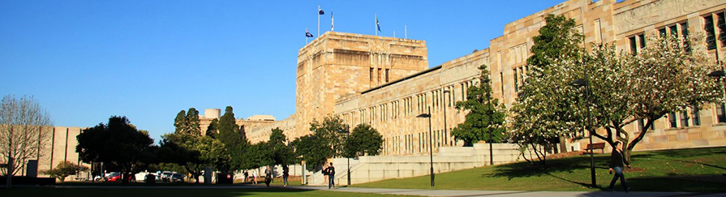

```{r setup, include=FALSE}
knitr::opts_chunk$set(echo = TRUE)
```


<br>

<br>

# Welcome

Welcome to **Open Data Science Training at the University of Queensland**, hosted by The Faculty of Science and The Centre for Biodiversity and Conservation Science in Brisbane, Australia, from June 18-19, 2019. 

Registration is now closed. The event is funded by The Faculty of Science Emerging Leaders Programme, and is free to attend. The course will be held in Steele Building Room 315. 

# Course Description

This training workshop will introduce you to open data science so you can work with data in an open, reproducible, and collaborative way. Open data science means that methods, data, and code are available so that others can access, reuse, and build from it without much fuss. Coding and using collaborative software helps you  reproduce your analyses, be more efficient, and share and collaborate easily with others. Here you will learn a reproducible science workflow with R, RStudio, Git, and GitHub, as recently described in [Lowndes *et al.* 2017, *Nature Ecology & Evolution*](https://www.nature.com/articles/s41559-017-0160).

This workshop is going to be fun, because learning these open data science tools and practices is empowering! We will live-code as we teach, with you doing everything hands-on on your own computer as you learn. [Our training materials](http://ohi-science.org/data-science-training/) that we use to teach are online and available for you as a reference. It can also be used as self-paced learning, or you can use it to teach an in-person workshop, as we have done with [Software Carpentry](https://jules32.github.io/2017-11-30-MBARI/).

This workshop is for you if: 

- the question 'can you redo your analysis but just in this time span?' sends chills down your spine...
- you've ever emailed files with collaborators (including yourself) that have names like `data_analysis_v5.xls` or `script_final_2017_03_04.R`...

Our 2-day workshop will give you exposure to the best available free resources today, hands-on experience coding with them on your own computer, and confidence to continue using them in your own research. And you'll have a community of peers to continue coding with after the workshop. 

We will cover:

- programming and data wrangling, and visualization with R and RStudio 
- version control with git and GitHub 
- reproducible documents and publishing with RMarkdown 

***No prior experience with R, RStudio, and GitHub are required.*** 

## Workshop schedule 

Steele Building Room 315. 

*Note: schedule and materials may change slightly prior to the workshop*

<!---

Google drive folder *[link forthcoming]*

--->

```{r, echo=FALSE, child="uq-schedule.Rmd"}
```

---

## Prerequisites

Before the training, please make sure you have done the following. 

Read [Lowndes *et al.* 2017, *Nature Ecology & Evolution*](https://www.nature.com/articles/s41559-017-0160).

Have up-to-date versions of `R` and RStudio and have RStudio configured with Git/GitHub: 

1. Download and install R: https://cloud.r-project.org
2. Download and install RStudio: http://www.rstudio.com/download 
3. Create a GitHub account: https://github.com *Note! Shorter names that kind of identify you are better*


## Instructor Bios

Instructors are part of the [Ocean Health Index](http://ohi-science.org) team at the National Center for Ecological Analysis and Synthesis [(NCEAS)](https://www.nceas.ucsb.edu/). 

### Julie Lowndes [@juliesquid](https://twitter.com/juliesquid)

[Julie Lowndes](https://jules32.github.io/) is a marine ecologist, data scientist, and [Mozilla Fellow](https://blog.mozilla.org/blog/2018/08/21/mozilla-announces-25-new-fellows-in-openness-science-and-tech-policy/) at NCEAS. As founding director of [Openscapes](https://openscapes.org) and science program lead of the Ocean Health Index, she works to increase the value and practice of environmental open data science. She is a co-founder of [EcoDataScience](http://eco-data-science.github.io/) and [R-Ladies Santa Barbara](https://www.meetup.com/rladies-santa-barbara/) and is a [Carpentries](https://carpentries.org/) instructor.  She earned her PhD at Stanford University in 2012 studying drivers and impacts of Humboldt squid in a changing climate.  


### Jamie Afflerbach [@jafflerbach](https://twitter.com/jafflerbach)

[Jamie Afflerbach](https://www.jamieafflerbach.com/) is a marine data scientist at NCEAS. She is lead analyst for the [US Northeast Ocean Health Index assessment](http://ohi-northeast.weebly.com/) and one of many scientists working on the annual global OHI assessments. Her work includes assessing the global status of fisheries using data limited methods and synthesizing large spatial datasets to estimate and track human impacts on the global oceans. She is also an enthusiastic proponent of open science and has taught data science training workshops around the US while coordinating two local Santa Barbara data sicence groups, [EcoDataScience](http://eco-data-science.github.io/) and [R-Ladies Santa Barbara](https://www.meetup.com/rladies-santa-barbara/). 

### Melanie Frazier

Melanie Frazier is a marine scientist at NCEAS. Prior to NCEAS, she worked at the U.S. Environmental Protection Agency developing ballast water discharge standards and statistical methods for improving indicators of estuarine health. She loves data and statistics because they can reveal hidden patterns and help us see beyond our biases. She finds it very satisfying to teach people new skills that will make their lives easier and improve their science!

### Ben Halpern 

Ben Halpern is Director of NCEAS and professor at the Bren School of Environmental Science & Management at the University of California, Santa Barbara. Ben’s research interests are primarily in marine ecology and conservation planning but span a wide range of disciplines. He has led several broad research programs addressing different aspects of managing ocean ecosystems, including a global synthesis of how much and where marine protected areas (MPAs) meet conservation and fisheries objectives, development of new tools and the application of them to a global assessment mapping the cumulative impact of human activities on the ocean, and development and global application of the OHI.
